# Arbitrage Intelligence Setup

This document explains how to configure and use the **Arbitrage Intelligence** feature in PredictOS.

## Overview

Arbitrage Intelligence is an AI-powered cross-platform arbitrage detection system that finds price discrepancies between **Polymarket** and **Kalshi** prediction markets. Simply paste a market URL from either platform, and the system will automatically search for the same market on the other platform, analyze pricing differences, and provide actionable arbitrage strategies.

## How It Works

```mermaid
flowchart TB
    subgraph INPUT["📥 Input"]
        URL[/"Market URL<br/>(Polymarket or Kalshi)"/]
    end

    subgraph DETECT["🔍 Platform Detection"]
        D1{Detect Platform}
        D2[Extract Event Slug/Ticker]
    end

    subgraph FETCH["📊 Source Data"]
        F1["Fetch Event Data<br/>(Title + Markets + Prices)"]
        F2["DFlow API<br/>(Kalshi)"]
        F3["Gamma API<br/>(Polymarket)"]
    end

    subgraph AI_SEARCH["🤖 AI Search Agent"]
        S1["Generate 1-2 Word<br/>Search Query"]
        S2["Search OTHER Platform<br/>for Matching Markets"]
    end

    subgraph AI_ANALYZE["🧠 Arbitrage Analysis Agent"]
        A1["Compare Source vs<br/>Search Results"]
        A2{"Same Market?"}
        A3["Calculate Price<br/>Differentials"]
        A4["Generate Arbitrage<br/>Strategy"]
    end

    subgraph OUTPUT["📤 Results"]
        O1["Market Comparison"]
        O2["Arbitrage Opportunity"]
        O3["Strategy & Risks"]
    end

    URL --> D1
    D1 -->|Polymarket| D2
    D1 -->|Kalshi| D2
    D2 --> F1
    F1 -->|Kalshi URL| F2
    F1 -->|Polymarket URL| F3
    F2 --> S1
    F3 --> S1
    S1 --> S2
    S2 -->|No Results| O1
    S2 -->|Results Found| A1
    A1 --> A2
    A2 -->|Yes| A3
    A2 -->|No| O1
    A3 --> A4
    A4 --> O2
    O2 --> O3

    style INPUT fill:#1e3a5f,stroke:#3b82f6
    style AI_SEARCH fill:#312e81,stroke:#6366f1
    style AI_ANALYZE fill:#1e3a5f,stroke:#3b82f6
    style OUTPUT fill:#14532d,stroke:#22c55e
```



### Flow Steps

1. **Parse Input URL** — Detect if the URL is from Polymarket or Kalshi and extract the event identifier (slug or ticker)

2. **Fetch Source Data** — Get the event title, all associated markets, and current YES prices from the source platform

3. **AI Search Query Generation** — An AI agent analyzes the event title and generates optimal 1-2 word search terms for the other platform

4. **Cross-Platform Search** — Search the OTHER platform using the generated query to find potentially matching markets

5. **Arbitrage Analysis** — If matching markets are found, an AI agent:
   - Determines if the markets are truly the same (with confidence score)
   - Compares YES/NO prices across platforms
   - Calculates arbitrage opportunities
   - Generates actionable trading strategy

6. **Results** — Returns detailed analysis including market comparison, profit potential, and risk factors

---

## Arbitrage Strategy

When an arbitrage opportunity is found, the system provides a complete strategy:

| Component | Description |
|-----------|-------------|
| **Buy YES On** | Platform with lower YES price |
| **Buy NO On** | Platform with lower NO price |
| **Total Cost** | Combined cost for $1 notional on each side |
| **Guaranteed Payout** | Always $1.00 (one side wins) |
| **Net Profit** | Payout minus total cost |
| **Profit %** | Net profit as percentage |

### Example Arbitrage

| Platform | YES Price | NO Price |
|----------|-----------|----------|
| Polymarket | 52% | 48% |
| Kalshi | 48% | 52% |

**Strategy:** Buy YES on Kalshi (48¢) + Buy NO on Polymarket (48¢) = 96¢ total cost → $1.00 payout → **4.2% profit**

---

## Required Environment Variables

Add these to your `supabase/.env.local` file:

### 1. DFlow API Key (Required for Kalshi)

```env
DFLOW_API_KEY=your_dflow_api_key
```

**What it's for:** DFlow provides programmatic access to Kalshi prediction market data.

**How to get it:**
- Contact DFlow: [https://x.com/dflow](https://x.com/dflow)
- Visit: [https://pond.dflow.net/introduction](https://pond.dflow.net/introduction)

### 2. AI Provider API Key (One Required)

You need **at least one** of the following AI provider keys:

#### Option A: xAI Grok (Recommended)

```env
XAI_API_KEY=your_xai_api_key
```

**How to get it:**
1. Go to [https://x.ai](https://x.ai)
2. Create an account or sign in
3. Navigate to API section
4. Generate a new API key

#### Option B: OpenAI GPT

```env
OPENAI_API_KEY=your_openai_api_key
```

**How to get it:**
1. Go to [https://platform.openai.com](https://platform.openai.com)
2. Create an account or sign in
3. Navigate to API Keys
4. Generate a new API key

> 💡 **Note:** You can configure both providers to switch between them in the UI.

---

## Complete Example

Your `supabase/.env.local` file should include:

```env
# =============================================================================
# ARBITRAGE INTELLIGENCE
# =============================================================================

# DFlow API - Required for Kalshi market data
DFLOW_API_KEY=your_dflow_api_key

# AI Provider - At least one is required
XAI_API_KEY=your_xai_api_key        # Option A: xAI Grok
OPENAI_API_KEY=your_openai_api_key  # Option B: OpenAI GPT
```

## Frontend Environment Variables

In addition to the backend variables above, configure the frontend (`terminal/.env`):

```env
SUPABASE_URL=<API URL from supabase status>
SUPABASE_ANON_KEY=<anon key from supabase status>

# Edge Function URL (for local development)
SUPABASE_EDGE_FUNCTION_ARBITRAGE_FINDER=http://127.0.0.1:54321/functions/v1/arbitrage-finder
```

## Verification

After setting up your environment variables:

1. Start the Supabase services:
   ```bash
   cd supabase
   supabase start
   supabase functions serve --env-file .env.local
   ```

2. Start the frontend:
   ```bash
   cd terminal
   npm run dev
   ```

3. Navigate to [http://localhost:3000/arbitrage](http://localhost:3000/arbitrage)

4. Paste a Polymarket or Kalshi URL and click "Find Arb" to test

## Supported AI Models

| Provider | Models |
|----------|--------|
| **xAI Grok** | Grok 4.1 Fast (Reasoning), Grok 4.1 Fast (Non-Reasoning), Grok 4 Fast (Reasoning), Grok 4 Fast (Non-Reasoning) |
| **OpenAI** | GPT-5.2, GPT-5.1, GPT-5 Nano, GPT-4.1, GPT-4.1 Mini |

## Troubleshooting

| Error | Solution |
|-------|----------|
| "DFLOW_API_KEY is not configured" | Add your DFlow API key to `.env.local` |
| "No AI provider configured" | Add either XAI_API_KEY or OPENAI_API_KEY |
| "Invalid URL" | Ensure you're pasting a valid Polymarket or Kalshi market URL |
| "Could not fetch event data" | The event may not exist or the API may be temporarily unavailable |
| "No matching markets found" | The market may not exist on the other platform |

## Data Providers

| Platform | Provider | Features |
|----------|----------|----------|
| **Kalshi** | 🔷 [DFlow](https://pond.dflow.net/introduction) | Event data, market prices, search API |
| **Polymarket** | 🌐 [Gamma API](https://gamma-api.polymarket.com) | Event data, market prices, public search |

---

← [Back to main README](../../README.md)

