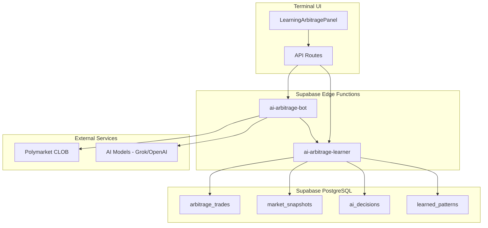
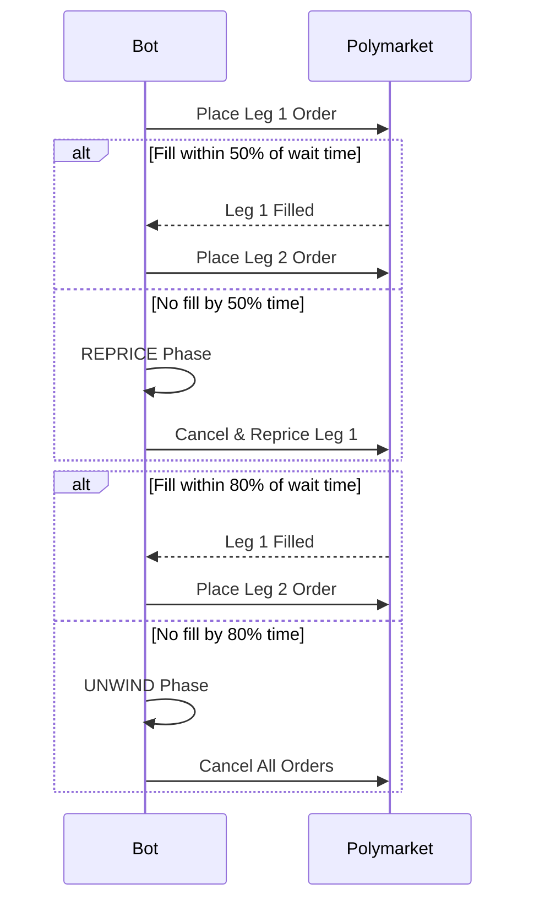

# Self-Learning AI Arbitrage System

A sophisticated self-learning arbitrage trading system that continuously improves its performance by learning from every trade outcome.

## Overview

The Learning Arbitrage system combines:
- **Historical Trade Recording**: Every trade attempt and outcome is stored for analysis
- **Pattern Extraction**: Automated pattern discovery from trade history
- **AI-Powered Decisions**: Uses learned patterns to inform trading decisions
- **Confidence Calibration**: Self-adjusting confidence based on historical accuracy
- **Graduated Response System**: WAIT -> REPRICE -> UNWIND strategy for optimal fills

## Architecture



## Database Schema

### arbitrage_trades
Stores all trade attempts and outcomes.

| Column | Type | Description |
|--------|------|-------------|
| id | UUID | Primary key |
| created_at | TIMESTAMPTZ | Trade timestamp |
| market_slug | TEXT | Market identifier |
| leg1_token_id | TEXT | First leg token ID |
| leg1_side | TEXT | BUY or SELL |
| leg1_price | DECIMAL | Order price (0-1) |
| leg1_size | DECIMAL | Order size |
| leg2_token_id | TEXT | Second leg token ID |
| leg2_side | TEXT | BUY or SELL |
| leg2_price | DECIMAL | Order price (0-1) |
| leg2_size | DECIMAL | Order size |
| leg1_fill_time_ms | INTEGER | Time to fill leg 1 |
| leg2_fill_time_ms | INTEGER | Time to fill leg 2 |
| outcome | TEXT | both_filled, leg1_only, leg2_only, neither, unwound |
| profit_loss_usdc | DECIMAL | Realized P&L |
| ai_prediction_correct | BOOLEAN | Was AI prediction accurate |

### market_snapshots
Captures market conditions at key moments during trade execution.

| Column | Type | Description |
|--------|------|-------------|
| id | UUID | Primary key |
| trade_id | UUID | FK to arbitrage_trades |
| snapshot_type | TEXT | pre_trade, leg1_placed, leg2_placed, etc. |
| orderbook_spread | DECIMAL | Bid-ask spread |
| orderbook_depth_at_price | DECIMAL | Liquidity at price level |
| mid_price | DECIMAL | Mid-market price |
| volatility_1min | DECIMAL | 1-minute volatility |
| time_of_day | TIME | Time without date |
| day_of_week | INTEGER | 0-6 for Sunday-Saturday |

### ai_decisions
Tracks AI recommendations and their accuracy.

| Column | Type | Description |
|--------|------|-------------|
| id | UUID | Primary key |
| trade_id | UUID | FK to arbitrage_trades |
| decision | TEXT | execute, wait, skip, reprice, unwind |
| confidence_score | DECIMAL | 0.0 to 1.0 |
| reasoning | TEXT | AI's explanation |
| was_correct | BOOLEAN | Set after outcome known |
| model_used | TEXT | AI model identifier |
| historical_fill_rate | DECIMAL | Fill rate for similar conditions |
| confidence_adjustment | DECIMAL | Calibration adjustment applied |

### learned_patterns
Extracted patterns from historical data.

| Column | Type | Description |
|--------|------|-------------|
| id | UUID | Primary key |
| pattern_type | TEXT | spread_fill_rate, time_of_day_fill_rate, etc. |
| conditions_json | JSONB | Pattern conditions |
| fill_rate_percent | DECIMAL | Historical fill rate |
| avg_fill_time_ms | INTEGER | Average fill time |
| sample_size | INTEGER | Number of trades analyzed |
| is_active | BOOLEAN | Pattern validity flag |

## Edge Functions

### ai-arbitrage-learner

The learning engine that manages all data recording and pattern extraction.

**Actions:**
- `record_trade`: Store new trade attempt
- `record_outcome`: Update trade with final outcome
- `record_snapshot`: Store market condition snapshot
- `record_decision`: Log AI decision
- `extract_patterns`: Analyze trades and extract patterns
- `get_patterns`: Retrieve learned patterns
- `get_ai_accuracy`: Get AI performance metrics
- `get_trade_history`: Fetch recent trades
- `calibrate_confidence`: Calculate confidence adjustment

**Example Request:**
```json
{
  "action": "get_patterns",
  "data": {
    "min_sample_size": 10,
    "pattern_type": "spread_fill_rate"
  }
}
```

### ai-arbitrage-bot

The trading engine that executes arbitrage with learning integration.

**Features:**
- Fetches learned patterns before each trade
- Uses AI with historical context for decisions
- Records all trade data to learning system
- Graduated response: WAIT -> REPRICE -> UNWIND
- **feeRateBps: 1000 on ALL createOrder calls**

**Request Format:**
```json
{
  "market_slug": "btc-15m-up-down",
  "leg1_token_id": "123...",
  "leg1_side": "BUY",
  "leg1_price": 0.45,
  "leg1_size": 100,
  "leg2_token_id": "456...",
  "leg2_side": "BUY",
  "leg2_price": 0.45,
  "leg2_size": 100,
  "model": "grok-4-1-fast-reasoning",
  "max_wait_ms": 30000,
  "auto_unwind": true
}
```

**Response Format:**
```json
{
  "success": true,
  "trade_id": "uuid",
  "leg1_result": { "success": true, "order_id": "...", "fill_time_ms": 1234 },
  "leg2_result": { "success": true, "order_id": "...", "fill_time_ms": 2345 },
  "outcome": "both_filled",
  "profit_loss_usdc": 5.00,
  "ai_decision": {
    "decision": "execute",
    "confidence": 0.85,
    "reasoning": "Historical fill rate for this spread is 78%"
  },
  "execution_time_ms": 5678,
  "logs": ["..."]
}
```

## Pattern Types

The system learns the following pattern types:

1. **spread_fill_rate**: Fill rates based on orderbook spread buckets
   - tight_0_0.5, medium_0.5_1, wide_1_2, very_wide_2_plus

2. **time_of_day_fill_rate**: Fill rates by time of day
   - morning_9_12, afternoon_12_15, late_afternoon_15_18, evening_18_21, night_21_9

3. **size_fill_rate**: Fill rates by order size/price level
   - low_0_30, medium_30_50, high_50_70, very_high_70_100

4. **ai_accuracy_by_confidence**: AI prediction accuracy by confidence level
   - low_0_50, medium_50_70, high_70_85, very_high_85_100

## Confidence Calibration

The system automatically calibrates AI confidence based on historical accuracy:

```
if recent_accuracy < 50%: adjustment = -15%
if recent_accuracy < 65%: adjustment = -10%
if recent_accuracy < 75%: adjustment = -5%
if recent_accuracy > 85%: adjustment = +5%
else: adjustment = 0%
```

This prevents overconfident predictions and improves decision quality over time.

## Graduated Response System

When executing trades, the bot uses a graduated response strategy:



## Terminal UI

The `LearningArbitragePanel` component provides:

- **Stats Overview**: Total trades, success rate, P&L, pattern count
- **Confidence Calibration**: Current adjustment and reasoning
- **AI Accuracy**: Overall and by-decision/model breakdown
- **Learned Patterns**: Visualized with fill rates and sample sizes
- **Trade History**: Searchable table with outcomes and P&L

## Environment Variables

### Supabase Edge Functions

```env
# Required
SUPABASE_URL=http://localhost:54321
SUPABASE_SERVICE_ROLE_KEY=your-service-role-key

# Polymarket Trading
POLYMARKET_WALLET_PRIVATE_KEY=your-private-key
POLYMARKET_PROXY_WALLET_ADDRESS=your-proxy-address
POLYMARKET_SIGNATURE_TYPE=1

# AI (at least one required)
XAI_API_KEY=your-xai-key
OPENAI_API_KEY=your-openai-key
```

### Terminal

```env
SUPABASE_URL=http://localhost:54321
SUPABASE_ANON_KEY=your-anon-key
```

## Usage

### Running Pattern Extraction

Patterns should be extracted periodically (e.g., hourly):

```typescript
// Via API
await fetch("/api/ai-arbitrage-learner", {
  method: "POST",
  headers: { "Content-Type": "application/json" },
  body: JSON.stringify({ action: "extract_patterns" }),
});
```

### Executing a Trade

```typescript
await fetch("/api/ai-arbitrage-bot", {
  method: "POST",
  headers: { "Content-Type": "application/json" },
  body: JSON.stringify({
    market_slug: "btc-15m-up-down",
    leg1_token_id: "...",
    leg1_side: "BUY",
    leg1_price: 0.45,
    leg1_size: 100,
    leg2_token_id: "...",
    leg2_side: "BUY",
    leg2_price: 0.45,
    leg2_size: 100,
    model: "grok-4-1-fast-reasoning",
  }),
});
```

## Deployment

1. **Run Migrations**
   ```bash
   supabase db push
   ```

2. **Deploy Edge Functions**
   ```bash
   supabase functions deploy ai-arbitrage-learner
   supabase functions deploy ai-arbitrage-bot
   ```

3. **Build Terminal**
   ```bash
   cd terminal && npm run build
   ```

## Troubleshooting

### No Patterns Learned
- Ensure at least 5 trades have been executed
- Check that trades have completed outcomes (not "pending")
- Run pattern extraction manually

### AI Decisions Not Recorded
- Verify SUPABASE_SERVICE_ROLE_KEY is set
- Check Edge Function logs for errors

### Low Fill Rates
- Review spread patterns - tighter spreads have higher fill rates
- Consider time of day patterns
- Adjust max_wait_ms for more patience

### Confidence Calibration Issues
- Need at least 20 AI decisions with known outcomes
- Check ai_decisions.was_correct is being updated

## Future Improvements

- WebSocket-based fill monitoring for faster response
- Machine learning model for pattern prediction
- Cross-market pattern learning
- Automated strategy adjustment based on market conditions
- Real-time pattern updates (vs. periodic extraction)
