# Super Intelligence Setup

This document explains how to configure and use the **Predict Super Intelligence** feature in PredictOS — the multi-agent AI system for intelligent prediction market analysis and execution.

## Overview

Predict Super Intelligence is a powerful multi-agent system that coordinates multiple AI models to analyze prediction markets and optionally execute trades automatically.

| Mode | Description | Requirements |
|------|-------------|--------------|
| **🔍 Supervised** | Agents analyze markets and provide recommendations. User reviews and executes via OkBet. | Dome API (Polymarket) + AI Provider(s) |
| **⚡ Autonomous** | Agents analyze markets and automatically execute trades within your budget. | Dome API (Polymarket) + AI Provider(s) + Polymarket Wallet |

## Architecture

### Data Provider Layer

PredictOS uses specialized data providers for each prediction market platform:

```mermaid
%%{init: {'theme': 'dark', 'themeVariables': { 'primaryColor': '#6366f1', 'primaryTextColor': '#fff', 'primaryBorderColor': '#818cf8', 'lineColor': '#a5b4fc', 'secondaryColor': '#1e1b4b'}}}%%

flowchart TB
    subgraph INPUT["🔗 Market URL Input"]
        URL["Paste Kalshi or Polymarket URL"]
    end

    URL --> DETECT{{"🔍 Platform<br/>Detection"}}
    
    DETECT -->|"kalshi.com/*"| DFLOW
    DETECT -->|"polymarket.com/*"| DOME
    
    subgraph KALSHI["🏛️ KALSHI MARKETS"]
        DFLOW["🔷 DFlow API<br/><small>a.prediction-markets-api.dflow.net</small>"]
        K_FEATURES["<strong>Features:</strong><br/>• Event ticker resolution<br/>• Yes/No bid & ask prices<br/>• Volume & 24h volume<br/>• Liquidity metrics<br/>• Open interest<br/>• Market status"]
        DFLOW --> K_FEATURES
    end
    
    subgraph POLY["🟣 POLYMARKET"]
        DOME["🌐 Dome API<br/><small>api.domeapi.io</small>"]
        P_FEATURES["<strong>Features:</strong><br/>• Condition ID & tokens<br/>• CLOB token IDs<br/>• Outcome prices<br/>• Order book access<br/>• WebSocket feeds<br/>• Trade execution"]
        DOME --> P_FEATURES
    end
    
    K_FEATURES --> UNIFIED["📊 Unified Market Data"]
    P_FEATURES --> UNIFIED
    UNIFIED --> AGENTS["🤖 AI Agents"]

    style URL fill:#3730a3,stroke:#6366f1,color:#e0e7ff
    style DETECT fill:#6366f1,stroke:#818cf8,color:#fff
    style DFLOW fill:#6366f1,stroke:#818cf8,color:#fff
    style DOME fill:#059669,stroke:#34d399,color:#fff
    style K_FEATURES fill:#4f46e5,stroke:#818cf8,color:#fff
    style P_FEATURES fill:#047857,stroke:#10b981,color:#fff
    style UNIFIED fill:#3730a3,stroke:#6366f1,color:#e0e7ff
    style AGENTS fill:#7c3aed,stroke:#a78bfa,color:#fff
```



| Platform | Data Provider | API Endpoint | API Key Required |
|----------|---------------|--------------|------------------|
| **Kalshi** | 🔷 **DFlow** | `a.prediction-markets-api.dflow.net/api/v1` | ✅ Yes |
| **Polymarket** | 🌐 **Dome** | `api.domeapi.io` | ✅ Yes |

> 💡 **Note:** Both DFlow and Dome APIs require API keys. Contact [DFlow](https://x.com/dflow) to obtain your `DFLOW_API_KEY`.

### Full System Architecture

```mermaid
%%{init: {'theme': 'dark', 'themeVariables': { 'primaryColor': '#6366f1', 'primaryTextColor': '#fff', 'primaryBorderColor': '#818cf8', 'lineColor': '#a5b4fc', 'secondaryColor': '#1e1b4b', 'tertiaryColor': '#312e81', 'background': '#0f0f23', 'mainBkg': '#1e1b4b', 'nodeBorder': '#6366f1', 'clusterBkg': '#1e1b4b80', 'clusterBorder': '#6366f1', 'titleColor': '#e0e7ff', 'edgeLabelBackground': '#1e1b4b'}}}%%

flowchart TB
    subgraph DATA["📊 DATA LAYER"]
        URL["🔗 Market URL<br/><small>Kalshi / Polymarket</small>"]
        
        URL --> DETECT{{"Platform?"}}
        
        DETECT -->|Kalshi| DFLOW["🔷 DFlow API"]
        DETECT -->|Polymarket| DOME["🌐 Dome API"]
        
        DFLOW --> MARKET["📈 Market Data<br/><small>Prices • Outcomes • Metadata</small>"]
        DOME --> MARKET
    end

    subgraph ANALYSIS["🤖 ANALYSIS LAYER"]
        direction TB
        subgraph AGENTS["Predict Agents"]
            direction LR
            A1["🤖 Agent 1<br/><small>Grok 4.1</small><br/><small>🔍 X Search</small>"]
            A2["🤖 Agent 2<br/><small>GPT-5.2</small><br/><small>📚 Polyfactual</small>"]
            AN["🤖 Agent N<br/><small>Custom Model</small><br/><small>🌐 Web Search</small>"]
        end
        
        BOOKMAKER["⚖️ BOOKMAKER AGENT<br/><small>Judge / Aggregator</small><br/><br/>• Synthesizes analyses<br/>• Weights by confidence<br/>• Calculates consensus"]
        
        A1 & A2 & AN --> BOOKMAKER
    end

    subgraph EXECUTION["⚡ EXECUTION LAYER"]
        direction LR
        subgraph SUP["🔍 SUPERVISED"]
            VIEW["📋 View Analysis"]
            OKBET["🎯 OkBet Link"]
            MANUAL["👤 Manual Trade"]
            VIEW --> OKBET --> MANUAL
        end
        
        subgraph AUTO["⚡ AUTONOMOUS"]
            MAPPER["🗺️ MAPPER AGENT<br/><small>Translate to order</small><br/><small>Validate params</small><br/><small>Budget: $1-$100</small>"]
            ORDER["💱 PUT-ORDER<br/><small>Sign tx</small><br/><small>Submit to CLOB</small><br/><small>Confirm execution</small>"]
            MAPPER --> ORDER
        end
    end

    MARKET --> AGENTS
    BOOKMAKER --> SUP
    BOOKMAKER --> AUTO

    style URL fill:#3730a3,stroke:#6366f1,color:#e0e7ff
    style DETECT fill:#6366f1,stroke:#818cf8,color:#fff
    style DFLOW fill:#6366f1,stroke:#818cf8,color:#fff
    style DOME fill:#059669,stroke:#34d399,color:#fff
    style MARKET fill:#3730a3,stroke:#6366f1,color:#e0e7ff
    style A1 fill:#059669,stroke:#34d399,color:#fff
    style A2 fill:#0891b2,stroke:#22d3d8,color:#fff
    style AN fill:#7c3aed,stroke:#a78bfa,color:#fff
    style BOOKMAKER fill:#7c3aed,stroke:#a78bfa,color:#fff
    style VIEW fill:#1e40af,stroke:#3b82f6,color:#fff
    style OKBET fill:#d97706,stroke:#fbbf24,color:#fff
    style MANUAL fill:#1e40af,stroke:#3b82f6,color:#fff
    style MAPPER fill:#047857,stroke:#10b981,color:#fff
    style ORDER fill:#047857,stroke:#10b981,color:#fff
```



### Simplified Pipeline View

```mermaid
%%{init: {'theme': 'dark', 'themeVariables': { 'primaryColor': '#6366f1', 'primaryTextColor': '#fff', 'primaryBorderColor': '#818cf8', 'lineColor': '#a5b4fc', 'secondaryColor': '#1e1b4b'}}}%%

flowchart LR
    subgraph INPUT[" "]
        URL["🔗<br/>Market URL"]
    end

    subgraph FETCH[" "]
        direction TB
        DFLOW["🔷 DFlow<br/><small>Kalshi</small>"]
        DOME["🌐 Dome<br/><small>Polymarket</small>"]
    end

    subgraph AGENTS[" "]
        direction TB
        A1["🤖 Agent 1"]
        A2["🤖 Agent 2"]
        A3["🤖 Agent N"]
    end

    subgraph JUDGE[" "]
        BK["⚖️<br/>Bookmaker<br/>Agent"]
    end

    subgraph MODE[" "]
        direction TB
        S["🔍 Supervised<br/><small>OkBet Link</small>"]
        A["⚡ Autonomous<br/><small>Auto-Execute</small>"]
    end

    URL --> DFLOW & DOME
    DFLOW & DOME --> AGENTS
    A1 & A2 & A3 --> BK
    BK ==> MODE

    style URL fill:#3730a3,stroke:#6366f1,color:#e0e7ff
    style DFLOW fill:#6366f1,stroke:#818cf8,color:#fff
    style DOME fill:#059669,stroke:#34d399,color:#fff
    style A1 fill:#059669,stroke:#34d399,color:#fff
    style A2 fill:#0891b2,stroke:#22d3d8,color:#fff
    style A3 fill:#7c3aed,stroke:#a78bfa,color:#fff
    style BK fill:#7c3aed,stroke:#a78bfa,color:#fff
    style S fill:#d97706,stroke:#fbbf24,color:#fff
    style A fill:#047857,stroke:#10b981,color:#fff
```



---

## Required Environment Variables

### Backend Configuration (`supabase/.env.local`)

#### 1. Data Providers

##### Dome API Key (Required for Polymarket)

```env
DOME_API_KEY=your_dome_api_key
```

**What it's for:** Dome API provides access to Polymarket data including market prices, CLOB tokens, and order execution.

**How to get it:**
1. Go to [https://dashboard.domeapi.io](https://dashboard.domeapi.io)
2. Create an account or sign in
3. Navigate to API Keys section
4. Generate a new API key

##### DFlow API Key (Required for Kalshi)

```env
DFLOW_API_KEY=your_dflow_api_key
```

**What it's for:** DFlow API provides access to Kalshi market data including event prices, volume, liquidity, and open interest.

**API Endpoint:** `https://a.prediction-markets-api.dflow.net/api/v1`

**How to get it:**
1. Contact [DFlow](https://x.com/dflow) to request API access
2. They will provide you with an API key

**Data provided:**
- Event ticker and nested markets
- Yes/No bid & ask prices
- Last price, volume, 24h volume
- Liquidity and open interest
- Market status and close time

#### 2. AI Provider API Keys (At least one required)

You need **at least one** of the following AI provider keys:

##### Option A: xAI Grok (Recommended for tool use)

```env
XAI_API_KEY=your_xai_api_key
```

**Models available:** Grok 4.1 Fast (Reasoning/Non-Reasoning), Grok 4 Fast (Reasoning/Non-Reasoning)

**Unique features:** X (Twitter) Search, Web Search tools

**How to get it:**
1. Go to [https://x.ai](https://x.ai)
2. Create an account or sign in
3. Navigate to API section
4. Generate a new API key

##### Option B: OpenAI GPT

```env
OPENAI_API_KEY=your_openai_api_key
```

**Models available:** GPT-5.2, GPT-5.1, GPT-5 Nano, GPT-4.1, GPT-4.1 Mini

**How to get it:**
1. Go to [https://platform.openai.com](https://platform.openai.com)
2. Create an account or sign in
3. Navigate to API Keys
4. Generate a new API key

> 💡 **Note:** Configure both providers to mix and match models across agents. For example, use Grok with X Search for social sentiment and GPT for broader analysis.

#### 3. Polyfactual API Key (Optional)

```env
POLYFACTUAL_API_KEY=your_polyfactual_api_key
```

**What it's for:** Enables the Polyfactual Research tool for agents to get comprehensive, citation-backed answers.

**How to get it:** Contact Polyfactual to obtain an API key

> 💡 **Note:** The Polyfactual tool only works if this key is configured. Agents can use other tools without it.

#### 4. Polymarket Wallet (Required for Autonomous Mode)

```env
POLYMARKET_WALLET_PRIVATE_KEY=your_wallet_private_key
POLYMARKET_PROXY_WALLET_ADDRESS=your_proxy_wallet_address
```

**What it's for:** Required for Autonomous mode to automatically execute trades on Polymarket.

**How to get Private Key:**
1. Create an account on [https://polymarket.com](https://polymarket.com)
2. `profile drop-down` → `settings` → `Export Private Key`
3. **⚠️ IMPORTANT:** Never share your private key or commit it to version control

**How to get Proxy Wallet Address:**
1. Your proxy wallet is created automatically when you sign up
2. `profile drop-down` → `under username` → `click copy`

> 🔒 **Security Best Practice:** Create a dedicated wallet for bot trading with only the funds you're willing to risk. Never use your main wallet's private key.

---

### Frontend Configuration (`terminal/.env`)

```env
SUPABASE_URL=<API URL from supabase status>
SUPABASE_ANON_KEY=<anon key from supabase status>

# Super Intelligence Edge Function URLs (for local development)
SUPABASE_EDGE_FUNCTION_GET_EVENTS=http://127.0.0.1:54321/functions/v1/get-events
SUPABASE_EDGE_FUNCTION_EVENT_ANALYSIS_AGENT=http://127.0.0.1:54321/functions/v1/event-analysis-agent
SUPABASE_EDGE_FUNCTION_BOOKMAKER_AGENT=http://127.0.0.1:54321/functions/v1/bookmaker-agent
SUPABASE_EDGE_FUNCTION_MAPPER_AGENT=http://127.0.0.1:54321/functions/v1/mapper-agent
SUPABASE_EDGE_FUNCTION_POLYMARKET_PUT_ORDER=http://127.0.0.1:54321/functions/v1/polymarket-put-order
SUPABASE_EDGE_FUNCTION_POLYFACTUAL_RESEARCH=http://127.0.0.1:54321/functions/v1/polyfactual-research
```

---

## Complete Environment Example

### Full `supabase/.env.local` for Super Intelligence:

```env
# =============================================================================
# MARKET DATA PROVIDERS
# =============================================================================

# Dome API - Required for Polymarket markets
DOME_API_KEY=your_dome_api_key

# DFlow API - Required for Kalshi markets
# Contact DFlow to obtain: https://x.com/dflow
DFLOW_API_KEY=your_dflow_api_key

# =============================================================================
# AI PROVIDERS (At least one required)
# =============================================================================

# xAI Grok - Recommended for X Search and Web Search tools
XAI_API_KEY=your_xai_api_key

# OpenAI - Alternative/additional provider
OPENAI_API_KEY=your_openai_api_key

# =============================================================================
# AGENT TOOLS (Optional)
# =============================================================================

# Polyfactual Deep Research
POLYFACTUAL_API_KEY=your_polyfactual_api_key

# =============================================================================
# AUTONOMOUS MODE (Optional - for auto-execution on Polymarket)
# =============================================================================

# Polymarket Wallet
POLYMARKET_WALLET_PRIVATE_KEY=0x...your_private_key
POLYMARKET_PROXY_WALLET_ADDRESS=0x...your_proxy_wallet
```

---

## Using Super Intelligence

### Step 1: Navigate to Market Analysis

1. Start the Supabase backend: `cd supabase && supabase functions serve --env-file .env.local`
2. Start the frontend: `cd terminal && npm run dev`
3. Open [http://localhost:3000/market-analysis](http://localhost:3000/market-analysis)

### Step 2: Enter a Market URL

Paste a Kalshi or Polymarket event URL in the input field:

- **Kalshi:** `https://kalshi.com/markets/kxtechq1/will-nasdaq-be-up-2percent-in-q1-2024` → Uses **DFlow API**
- **Polymarket:** `https://polymarket.com/event/will-bitcoin-hit-100k-in-2024` → Uses **Dome API**

The system automatically detects the platform and routes to the appropriate data provider.

### Step 3: Configure Agents

#### Select Model

Each agent needs a model selected:

| Provider | Model | Best For |
|----------|-------|----------|
| xAI | Grok 4.1 Fast (Reasoning) | Complex analysis with step-by-step reasoning |
| xAI | Grok 4.1 Fast (Non-Reasoning) | Quick analysis without chain-of-thought |
| xAI | Grok 4 Fast (Reasoning/Non-Reasoning) | Balanced performance |
| OpenAI | GPT-5.2 | Most capable general analysis |
| OpenAI | GPT-5.1 | Strong analysis, faster |
| OpenAI | GPT-5 Nano | Lightweight, fastest |
| OpenAI | GPT-4.1 / GPT-4.1 Mini | Cost-effective options |

#### Select Tools (Optional)

| Tool | Provider | Description |
|------|----------|-------------|
| **X Search** | Grok only | Search X (Twitter) for real-time social sentiment |
| **Web Search** | Grok only | Search the web for news and information |
| **PolyFactual Research** | All models | Deep research with citations |

> 💡 **Tip:** X Search and Web Search only work with Grok models. If you select these tools with an OpenAI model, the model will automatically switch to Grok.

#### Add Custom Commands (Optional)

Enter natural language commands to focus agent analysis:

- "Focus on technical indicators and chart patterns"
- "Prioritize news from the last 24 hours"
- "Consider the impact of recent Fed announcements"
- "Analyze social media sentiment on this topic"

### Step 4: Add More Agents (Optional)

Click **Add Agent** to deploy multiple agents with different configurations. When you have 2+ agents:

- The **Bookmaker Agent** automatically activates
- It synthesizes all agent analyses into a consensus recommendation
- You'll see agreement metrics showing how agents align

### Step 5: Select Mode

#### Supervised Mode (Default)

- Agents analyze the market
- You review the analysis
- Click the OkBet link to manually place trades

#### Autonomous Mode (Polymarket only)

- Set your budget ($1 - $100)
- Agents analyze and the Mapper Agent translates to order parameters
- Trade is automatically placed on Polymarket
- You'll see order confirmation with details

### Step 6: Run Agents

Click **Run Agents** and watch the pipeline execute:

1. **Get Events** — Fetches market data via DFlow (Kalshi) or Dome (Polymarket)
2. **Agent Analysis** — Each agent processes the market independently
3. **Bookmaker Aggregation** — (If 2+ agents) Synthesizes all analyses
4. **Execution** — Either shows OkBet link (Supervised) or places order (Autonomous)

---

## Agent Pipeline Details

### Predict Agent

```mermaid
%%{init: {'theme': 'dark', 'themeVariables': { 'primaryColor': '#6366f1'}}}%%

flowchart TB
    subgraph AGENT["🤖 PREDICT AGENT"]
        direction TB
        
        subgraph CONFIG["Configuration"]
            MODEL["🧠 Model Selection<br/><small>Grok 4.1 / GPT-5.2 / etc.</small>"]
            TOOLS["🔧 Tools<br/><small>X Search • Web • Polyfactual</small>"]
            CMD["💬 Custom Command<br/><small>Natural language focus</small>"]
        end
        
        subgraph OUTPUT["Analysis Output"]
            PROB["📊 Probability Analysis"]
            ALPHA["💎 Alpha Detection"]
            REC["✅ Recommendation<br/><small>BUY YES / BUY NO / NO TRADE</small>"]
            SOURCES["📚 Sources & Citations"]
        end
        
        CONFIG --> OUTPUT
    end

    style MODEL fill:#4f46e5,stroke:#818cf8,color:#fff
    style TOOLS fill:#059669,stroke:#34d399,color:#fff
    style CMD fill:#7c3aed,stroke:#a78bfa,color:#fff
    style PROB fill:#1e40af,stroke:#3b82f6,color:#fff
    style ALPHA fill:#d97706,stroke:#fbbf24,color:#fff
    style REC fill:#047857,stroke:#10b981,color:#fff
    style SOURCES fill:#0891b2,stroke:#22d3d8,color:#fff
```



Each Predict Agent performs independent analysis:

**Output includes:**
- Market probability vs estimated actual probability
- Alpha opportunity assessment
- Predicted winner (YES/NO) with confidence
- Recommended action (BUY YES / BUY NO / NO TRADE)
- Key factors and risks
- Analysis reasoning
- Sources (X posts, web articles, citations)

### Bookmaker Agent

When multiple agents complete, the Bookmaker Agent:

- Weighs each agent's recommendation by confidence
- Identifies areas of agreement and disagreement
- Calculates consensus metrics
- Produces a final synthesized recommendation

**Consensus Levels:**
- **High** — Agents strongly agree on recommendation
- **Medium** — Some disagreement but majority alignment
- **Low** — Significant disagreement among agents

### Mapper Agent & Execution

```mermaid
%%{init: {'theme': 'dark'}}%%

flowchart TB
    ANALYSIS["⚖️ Bookmaker Analysis<br/><small>Consensus Recommendation</small>"]
    
    ANALYSIS --> DECISION{{"Mode?"}}
    
    DECISION -->|"🔍 Supervised"| S1["📋 View Full Analysis"]
    S1 --> S2["🎯 Get OkBet Link"]
    S2 --> S3["👤 User Reviews & Decides"]
    S3 --> S4["📱 Trade via OkBet/Manual"]
    
    DECISION -->|"⚡ Autonomous"| A1["🗺️ Mapper Agent"]
    A1 --> A2["💰 Budget Check<br/><small>$1-$100</small>"]
    A2 --> A3["📝 Build Order Params"]
    A3 --> A4["✍️ Sign Transaction"]
    A4 --> A5["📤 Submit to Polymarket"]
    A5 --> A6["✅ Order Confirmed"]
    
    style ANALYSIS fill:#7c3aed,stroke:#a78bfa,color:#fff
    style DECISION fill:#6366f1,stroke:#818cf8,color:#fff
    style S1 fill:#1e40af,stroke:#3b82f6,color:#fff
    style S2 fill:#d97706,stroke:#fbbf24,color:#fff
    style S3 fill:#1e40af,stroke:#3b82f6,color:#fff
    style S4 fill:#d97706,stroke:#fbbf24,color:#fff
    style A1 fill:#047857,stroke:#10b981,color:#fff
    style A2 fill:#047857,stroke:#10b981,color:#fff
    style A3 fill:#047857,stroke:#10b981,color:#fff
    style A4 fill:#047857,stroke:#10b981,color:#fff
    style A5 fill:#047857,stroke:#10b981,color:#fff
    style A6 fill:#059669,stroke:#34d399,color:#fff
```



In Autonomous mode, the Mapper Agent:

- Translates analysis output to Polymarket order parameters
- Determines correct token ID for the recommended side
- Calculates share quantity based on budget
- Validates minimum order requirements (5 shares)
- Enforces budget limits ($1-$100)

---

## Data Provider Details

### DFlow API (Kalshi)

DFlow provides comprehensive Kalshi market data through a REST API.

**Endpoint:** `https://a.prediction-markets-api.dflow.net/api/v1`

**API Key:** Required (contact [DFlow](https://x.com/dflow) to obtain)

**Example Request:**
```
GET /event/{event_ticker}?withNestedMarkets=true
Headers: x-api-key: your_dflow_api_key
```

**Response Data:**
```typescript
interface DFlowKalshiMarket {
  ticker: string;           // Market ticker
  event_ticker: string;     // Parent event ticker
  title: string;            // Market title
  subtitle?: string;        // Additional context
  status: string;           // Market status
  close_time: string;       // When market closes
  yes_bid: number;          // Best YES bid price
  yes_ask: number;          // Best YES ask price
  no_bid: number;           // Best NO bid price
  no_ask: number;           // Best NO ask price
  last_price: number;       // Last traded price
  volume: number;           // Total volume
  volume_24h: number;       // 24-hour volume
  liquidity: number;        // Available liquidity
  open_interest: number;    // Open contracts
}
```

### Dome API (Polymarket)

Dome provides Polymarket market data and trading capabilities.

**Features:**
- Market metadata and pricing
- CLOB token IDs for order placement
- WebSocket feeds for real-time updates
- Order execution via SDK

**API Key:** Required (get from [dashboard.domeapi.io](https://dashboard.domeapi.io))

---

## Troubleshooting

| Error | Solution |
|-------|----------|
| "DOME_API_KEY is not configured" | Add your Dome API key to `.env.local` (required for Polymarket) |
| "DFLOW_API_KEY is not configured" | Add your DFlow API key to `.env.local` (required for Kalshi) |
| "No AI provider configured" | Add either XAI_API_KEY or OPENAI_API_KEY |
| "Please select a model for all agents" | Choose a model from the dropdown for each agent |
| "Please select a model for the aggregator" | Choose a model for the Bookmaker Agent |
| "Agents recommend NO TRADE" | Agents found insufficient alpha opportunity |
| "Budget too small" | Increase budget or lower expected price |
| "Market is closed" | Select an active market |
| "Invalid wallet address format" | Use valid Ethereum address (0x + 40 hex chars) |
| "DFlow API error" | Check that the Kalshi event ticker is valid |

---

## Security Considerations

⚠️ **Important Security Notes:**

1. **Never commit your private key** to version control
2. **Use a dedicated trading wallet** with limited funds for Autonomous mode
3. **Keep your `.env.local` file** in `.gitignore`
4. **Start with Supervised mode** until you're comfortable with the system
5. **Monitor Autonomous trades** by checking your Polymarket account
6. **Budget limits are enforced** at $1-$100 per trade for safety

---

## Advanced Usage

### Multi-Agent Strategy Examples

**Conservative Consensus:**
- Agent 1: Grok 4.1 + X Search (social sentiment)
- Agent 2: GPT-5.2 + Polyfactual (deep research)
- Agent 3: Grok 4 + Web Search (news)
- Aggregator: GPT-5.1

**Speed-Optimized:**
- Agent 1: Grok 4.1 Fast Non-Reasoning
- Aggregator: GPT-5 Nano

**Research-Heavy:**
- Agent 1: GPT-5.2 + Polyfactual + Command: "Focus on historical data"
- Agent 2: GPT-5.2 + Polyfactual + Command: "Focus on recent developments"
- Aggregator: GPT-5.2

---

← [Back to main README](../../README.md)
