# 🛡️ Verifiable Agents

**Verifiable Agents** is a groundbreaking feature that brings transparency and accountability to AI-powered prediction market analysis by permanently storing all agent outputs on the [Irys](https://irys.xyz/) blockchain.

## Why Verifiable Agents?

In a world where AI agents make trading recommendations, trust matters. Verifiable Agents solve the "black box" problem by creating an immutable, publicly auditable record of every analysis:

- **Prove Your Track Record** — Build verifiable history of your AI agents' predictions over time
- **Transparent AI Decisions** — Anyone can audit the exact reasoning behind trading recommendations
- **Immutable Evidence** — Analysis data cannot be altered after the fact
- **Cross-Platform Verification** — Share Irys links to prove agent recommendations to others

## How It Works

1. **Enable Verification** — Click the "Verifiable" checkbox in the PREDICT AGENTS header before running agents
2. **Agents Analyze** — All Predict Agents, Bookmaker Agent, and (in Autonomous mode) Mapper Agent + Execution results are collected
3. **Upload to Irys** — After completion, all data is bundled and permanently uploaded to Irys blockchain
4. **Get Your Link** — A gateway URL is displayed at the bottom of the page for public verification

## What Gets Stored

When you enable Verifiable Agents, the following data is permanently stored on Irys:

```json
{
  "requestId": "pred-abc123xyz789...",
  "timestamp": "2025-12-30T02:57:23.083Z",
  "pmType": "Polymarket",
  "eventIdentifier": "super-bowl-champion-2026",
  "eventId": "12345",
  "analysisMode": "autonomous",
  "agentsData": [
    {
      "name": "Predict Agent 1",
      "type": "predict-agent",
      "model": "grok-4-1-fast-reasoning",
      "tools": ["x_search"],
      "userCommand": "Focus on recent team performance",
      "analysis": {
        "ticker": "...",
        "title": "Who will win Super Bowl 2026?",
        "marketProbability": 0.45,
        "estimatedActualProbability": 0.52,
        "recommendedAction": "BUY YES",
        "reasoning": "...",
        "keyFactors": ["..."],
        "risks": ["..."]
      },
      "polyfactualResearch": {
        "answer": "...",
        "citations": [...]
      }
    },
    {
      "name": "Predict Agent 2",
      "type": "predict-agent",
      "model": "gpt-4.1",
      "analysis": { /* ... */ }
    },
    {
      "name": "Predict Bookmaker Agent",
      "type": "bookmaker-agent",
      "model": "grok-4-1-fast-reasoning",
      "analysis": {
        /* aggregated analysis with consensus metrics */
        "agentConsensus": {
          "agreementLevel": "high",
          "majorityRecommendation": "BUY YES",
          "dissenting": []
        }
      }
    },
    {
      "name": "Mapper Agent",
      "type": "mapper-agent",
      "orderParams": {
        "tokenId": "...",
        "side": "BUY",
        "size": 100,
        "price": 0.52
      }
    },
    {
      "name": "Autonomous Execution",
      "type": "execution",
      "executionResult": {
        "status": "success",
        "orderId": "0x...",
        "side": "YES",
        "size": 100,
        "price": 0.52,
        "costUsd": 5.20
      }
    }
  ],
  "schemaVersion": "1.0.0"
}
```

### Data Breakdown

| Agent | What's Stored |
|-------|---------------|
| **Predict Agents** | Model, tools, custom commands, full analysis output, Polyfactual research (if enabled) |
| **Bookmaker Agent** | Model, aggregated analysis, consensus metrics |
| **Mapper Agent** | Order parameters generated from analysis (Autonomous mode only) |
| **Execution** | Trade status, order ID, side, size, price, cost (Autonomous mode only) |

## Configuration

### Environment Variables

Add these to your `terminal/.env` file:

```env
# =========================================================================================
# IRYS CONFIGURATION (for Verifiable Agent Analysis)
# =========================================================================================

# Irys chain environment: "mainnet" or "devnet"
# - mainnet: Uploads are paid with real SOL tokens, data is permanent
# - devnet: Uploads use free faucet tokens, data is deleted after ~60 days
IRYS_CHAIN_ENVIRONMENT=devnet

# Solana private key (base58 encoded) for signing Irys uploads
# Generate with: solana-keygen new --no-passphrase
IRYS_SOLANA_PRIVATE_KEY=your_solana_private_key_here

# Solana RPC URL (required for devnet, optional for mainnet)
# Devnet options: https://api.devnet.solana.com or https://rpc.ankr.com/solana_devnet
IRYS_SOLANA_RPC_URL=https://api.devnet.solana.com
```

### Devnet vs Mainnet

| Environment | Cost | Data Retention | Use Case |
|-------------|------|----------------|----------|
| **devnet** | Free (faucet tokens) | ~60 days | Testing, development |
| **mainnet** | SOL transaction fees | Permanent | Production, building track record |

> 💡 **Tip:** Start with `devnet` for testing — uploads are free but expire after ~60 days. Switch to `mainnet` for permanent storage when you're ready to build a verifiable track record.

### Getting Devnet SOL

For devnet testing, you'll need devnet SOL tokens:

1. Generate a new Solana keypair:
   ```bash
   solana-keygen new --no-passphrase -o devnet-wallet.json
   ```

2. Get your public key:
   ```bash
   solana-keygen pubkey devnet-wallet.json
   ```

3. Airdrop devnet SOL:
   ```bash
   solana airdrop 2 <your-public-key> --url devnet
   ```

4. Export the private key for your `.env` file (base58 format)

## UI Overview

### Enabling Verification

The "Verifiable" checkbox appears in the PREDICT AGENTS header, between the title and the Supervised/Autonomous mode toggle:

```
PREDICT AGENTS  [✓ Verifiable]  [Supervised | Autonomous]
```

### Upload Status

After agents complete, the verification footer shows the upload status:

- **Idle** — Waiting for agents to complete
- **Uploading** — Data being uploaded to Irys
- **Success** — Upload complete with gateway URL
- **Error** — Upload failed with error message

### Verification Link

On successful upload, you'll see:

```
┌─────────────────────────────────────────────────────────────┐
│ 🛡️ Verifiable Analysis on Irys              [✓ Verified]   │
│                                                             │
│ Analysis data has been permanently stored on Irys blockchain│
│                                                             │
│ ┌─────────────────────────────────────────────────────────┐ │
│ │ 🔗 https://gateway.irys.xyz/abc123...              →    │ │
│ └─────────────────────────────────────────────────────────┘ │
│                                                             │
│ Transaction ID: abc123...                                   │
└─────────────────────────────────────────────────────────────┘
```

Click the link to view your verified analysis data on the Irys gateway.

## Technical Details

### Architecture

```mermaid
flowchart TB
    subgraph AMA["🔮 AgenticMarketAnalysis"]
        direction TB
        
        subgraph Agents["Predict Agents"]
            A1["🤖 Agent 1"]
            A2["🤖 Agent 2"]
        end
        
        BA["📊 Bookmaker Agent"]
        MA["🗺️ Mapper Agent"]
        
        A1 & A2 --> BA
        BA --> MA
        
        CB["📦 Collect & Bundle"]
        MA --> CB
    end
    
    CB --> API["⚡ /api/irys-upload"]
    API --> IRYS[("🛡️ Irys Blockchain")]
    
    style AMA fill:#1a1a2e,stroke:#4a9eff,stroke-width:2px
    style Agents fill:#16213e,stroke:#4a9eff,stroke-width:1px
    style A1 fill:#0f3460,stroke:#4a9eff
    style A2 fill:#0f3460,stroke:#4a9eff
    style BA fill:#1a1a40,stroke:#e94560
    style MA fill:#1a1a40,stroke:#00d9ff
    style CB fill:#2d2d44,stroke:#ffd700
    style API fill:#1e3a5f,stroke:#4ade80
    style IRYS fill:#0d7377,stroke:#14ffec,stroke-width:3px
```



### Files

| File | Purpose |
|------|---------|
| `terminal/src/lib/irys.ts` | Utility functions for formatting upload data |
| `terminal/src/app/api/irys-upload/route.ts` | API route handling Irys uploads |
| `terminal/src/types/agentic.ts` | TypeScript types for Irys data structures |

### Dependencies

The Verifiable Agents feature uses these npm packages:

```json
{
  "@irys/upload": "^x.x.x",
  "@irys/upload-solana": "^x.x.x"
}
```

These are automatically installed when you run `npm install` in the terminal directory.

## Troubleshooting

### Common Issues

**"IRYS_CHAIN_ENVIRONMENT is not set"**
- Ensure you've added the environment variable to `terminal/.env`
- Restart the development server after adding env vars

**"IRYS_SOLANA_PRIVATE_KEY is not set"**
- Add your Solana private key in base58 format
- For devnet, generate a new key with `solana-keygen`

**"IRYS_SOLANA_RPC_URL is required for devnet"**
- Add `IRYS_SOLANA_RPC_URL=https://api.devnet.solana.com` to your `.env`

**Upload fails with insufficient funds**
- For devnet: Airdrop more SOL to your wallet
- For mainnet: Ensure your wallet has enough SOL for transaction fees

**Upload times out**
- Check your internet connection
- Try a different RPC URL
- Irys network may be congested; try again later

## Links

- [Irys Website](https://irys.xyz/)
- [Irys Documentation](https://docs.irys.xyz/)
- [Irys Gateway](https://gateway.irys.xyz/)
- [Solana Devnet Faucet](https://faucet.solana.com/)

